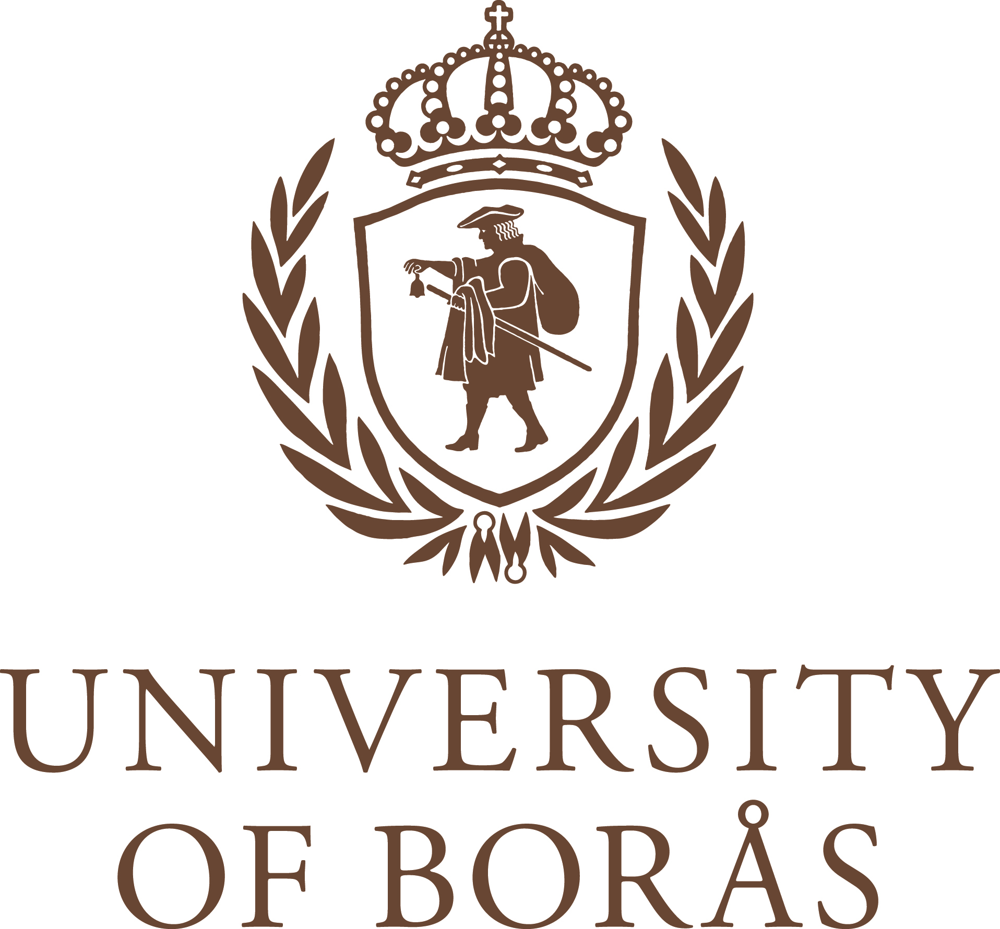

# FOREWORD {.unnumbered}

According to many students' experiences, thesis writing is the most rewarding part of higher education. This handbook aims at helping thesis authors in this stimulating task without taking away the responsibility and joy associated with independent, creative work. Thesis authors are encouraged to read through this handbook several times during their thesis writing period.

The guidelines in the handbook will answer many common questions in connection to thesis work. They also treat common shortcomings of students' theses. The handbook further outlines the administrative process and thesis project flow, along with the formal department's requirements related to the writing format as well as the grading system, supervision and other important parts of the thesis process. Thus, unnecessary mistakes can be avoided, and both authors' and supervisors'/tutors' time can be used more efficiently if authors carefully consider the advice presented here. This manual is intended to assist the student in completing the project on time and in designing and writing up the outcome of his or her work according to the set standards.

However, general guidelines presented cannot be applicable in every thesis writing process. If the authors feel that their own work does not fit the suggested structure (or vice versa), they have to trust their own judgement and make suitable adaptations. If substantial deviations from the guidelines' suggestions are considered, or in case of uncertainty, the assigned supervisor/tutor should be consulted.

This handbook is inspired from its equivalent developed previously by Jonas Stray and Håkan Torstensson for the Applied Textile Management Programme (in 2011), and Jenny Balkow (in 2015), and Rudrajeet Pal (in 2016), and subsequent updates by Vijay Kumar.

[VIJAY KUMAR](mailto:vijay.kumar@hb.se)

August 2021
